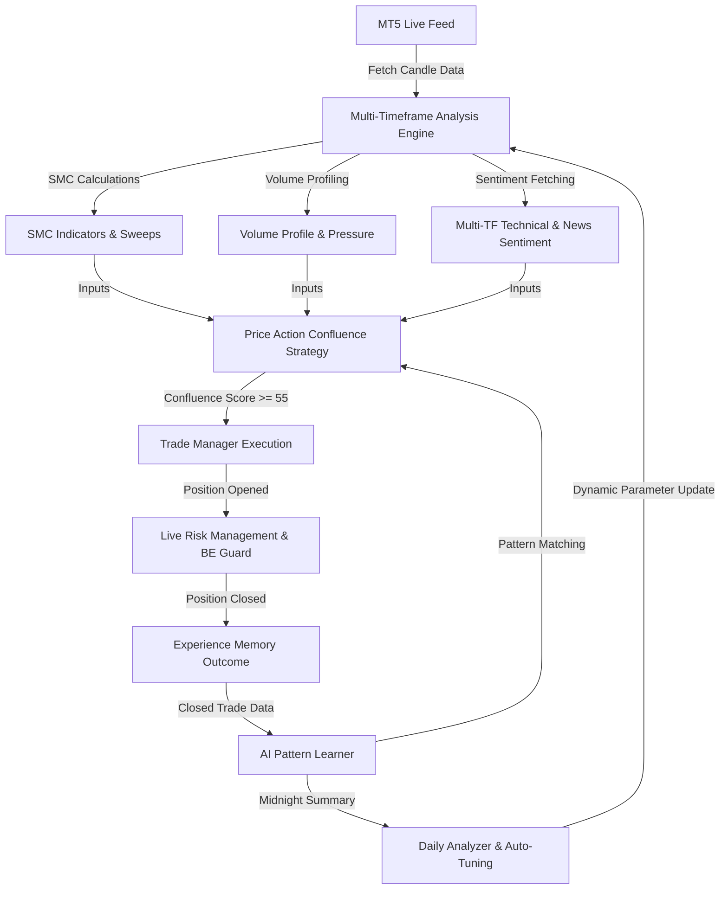

# PulseViper — SMC & Price Action Trading System Manual

PulseViper is a professional, high-performance agentic algorithmic trading system designed for MetaTrader 5 (MT5). It is engineered to detect institutional levels (Horizontal S/R Zones, Order Blocks, Volume Profile nodes, and Fibonacci key levels) and execute trades based on pure price action, volume pressure, and multi-timeframe sentiment alignment.

---

## 🗺️ System Architecture

The lifecycle of the system operates as a continuous real-time loop:



---

## 📁 Project Directory & File Reference

This section details every file in the PulseViper codebase, its purpose, and its internal logic.

### ⚙️ `configs/` — System Settings
1. **[config.py](file:///d:/pulse-viper/configs/config.py)**:
   - **Purpose**: Defines static configuration parameters for MetaTrader 5, default portfolio sizing, and operational thresholds.
   - **Key Parameters**: `MAGIC_NUMBER`, `INITIAL_BALANCE`, `RISK_PERCENT`, `MAX_SPREAD_POINTS`, and session times (`LONDON_SESSION`, `NY_SESSION`).
2. **[settings.json](file:///d:/pulse-viper/configs/settings.json)**:
   - **Purpose**: JSON-based dynamic settings file. Allows altering parameters (e.g. trading mode, risk percent, spread limits, trailing stops) while the system is running without needing to restart the engine.

### 🧠 `core/` — Execution Engine & AI Logic
3. **[engine.py](file:///d:/pulse-viper/core/engine.py)**:
   - **Purpose**: The main heartbeat of the bot. Runs the real-time 1-second update cycle.
   - **Key Logics**:
     - `run_multi_timeframe_analysis()`: Orchestrates fetching H1 (HTF), M15 (Context), and M5 (LTF) candle data, computing SMC structures, volume metrics, and caching technical sentiment.
     - `evaluate_entry_rules()`: Examines signals. Coordinates between SMC Sharp Turn setups (retaining pending pullbacks) and the fallback Price Action Confluence strategy ("FIB"), checking filters (news, AI learner confidence, spread) before calling the trade manager.
     - `self_configure_automation()`: Auto-tunes risk parameters nightly based on win rates and spread skips.
4. **[trade_manager.py](file:///d:/pulse-viper/core/trade_manager.py)**:
   - **Purpose**: Manages active positions, execution, Stop Loss, and Take Profit modifications.
   - **Key Logics**:
     - `open_position()`: Computes lot size based on balance and SL distance. Sends requests to MetaTrader 5.
     - `update_positions()`: Monitored on every tick.
     - **30-Second Risk-Free Breakeven**: If a position has been open for 30 seconds and is currently in profit, the SL is immediately relocated to the entry price to secure the trade against sudden reversals.
     - **Trailing Stop**: Gradually moves the SL in the direction of profit once price passes the trailing trigger threshold.
5. **[pattern_learner.py](file:///d:/pulse-viper/core/pattern_learner.py)**:
   - **Purpose**: The pattern matching engine.
   - **Key Logics**:
     - `_quantize_smc_state()`: Quantizes continuous parameters (HTF bias, premium/discount location, FVG class, volatility, sweeps/MSS) into a discrete string key.
     - `get_trading_signal()`: Matches the current market state key against winning/losing databases. If a highly profitable pattern is matched (win rate > 65%), it scale-boosts the TP. If a low-probability pattern is matched, it reduces risk or blocks the trade.
6. **[daily_analyzer.py](file:///d:/pulse-viper/core/daily_analyzer.py)**:
   - **Purpose**: Midnight scheduler.
   - **Key Logics**: Analyzes the previous day's performance, writes a daily text report under `logs/daily_reports/`, disables underperforming setups (WR < 30%), and adjusts target risk-to-reward boundaries.
7. **[experience_memory.py](file:///d:/pulse-viper/core/experience_memory.py)**:
   - **Purpose**: A local buffer storing active trade details and resolved outcome properties (PnL, duration, holding characteristics).
8. **[trade_journal.py](file:///d:/pulse-viper/core/trade_journal.py)**:
   - **Purpose**: A SQLite database wrapper (`logs/trade_journal.db`) recording permanent trade details for long-term audits.

### 📐 `strategies/` — Trading Strategy Logic
9. **[fib_retest.py](file:///d:/pulse-viper/strategies/fib_retest.py)**:
   - **Purpose**: The core decision maker. Houses the indicator-free Price Action Levels Confluence strategy.
   - **Key Logics**:
     - `detect_swing_points_pure()`: Finds local peaks and troughs in high/low candles without lags.
     - `find_sr_zones()`: Clusters swing points within `0.20 * ATR` proximity. The most dense clusters identify horizontal Support/Resistance zones.
     - `find_order_blocks()`: Scans for impulse expansions (candle moves exceeding `1.5 * ATR`). Flags the prior opposing candle body as an active Order Block until price closes past its boundaries (mitigation).
     - `detect_candlestick_reversal()`: Examines wicks and body ratios to catch Pin Bars (wick >= 45% of range) and Engulfing candles.
     - `detect_market_structure_trend()`: Evaluates if recent swing highs/lows are consecutively rising (bullish) or falling (bearish) using Dow Theory.
     - `evaluate_retest()`: Runs the Confluence Scoring algorithm (Level Touch + Reversal Candlestick + Volume Pressure + Multi-TF Sentiment). Triggers BUY or SELL if the score is >= 55/100, and calculates dynamic SL and TP based on structural swing sizes and volume pressure.

### 🛠️ `utils/` — Indicator Calculations & Interfaces
10. **[smc_indicators.py](file:///d:/pulse-viper/utils/smc_indicators.py)**:
    - **Purpose**: Vectorized SMC feature calculator.
    - **Key Logics**: Identifies Fair Value Gaps (FVG) and classifies them (PFVG, RFVG, BAG), tracks Liquidity Sweeps, and detects Market Structure Shifts (MSS) where candles close past swing highs/lows.
11. **[volume_analyzer.py](file:///d:/pulse-viper/utils/volume_analyzer.py)**:
    - **Purpose**: Transactional volume analyzer.
    - **Key Logics**: Calculates Relative Volume (RVOL) to catch institutional breakouts, buying/selling volume pressure, and profiles volume at price bins to detect Value Area High (VAH), Value Area Low (VAL), and Point of Control (POC).
12. **[sentiment_analyzer.py](file:///d:/pulse-viper/utils/sentiment_analyzer.py)**:
    - **Purpose**: Core sentiment calculator.
    - **Key Logics**: Calculates a technical sentiment index (-1.0 to +1.0) across 7 timeframes by analyzing RSI, MACD, and candle structure, and processes news feeds for high-impact USD events.
13. **[settings_manager.py](file:///d:/pulse-viper/utils/settings_manager.py)**:
    - **Purpose**: Manages Dynamic settings load/save from `settings.json`.
14. **[symbol_manager.py](file:///d:/pulse-viper/utils/symbol_manager.py)**:
    - **Purpose**: Fetches symbol properties from MT5 (e.g. contract size, minimum volume, spread points).
15. **[mt5_data.py](file:///d:/pulse-viper/utils/mt5_data.py)**:
    - **Purpose**: Handles connection initialization, reconnection, and shutdown with the MT5 terminal.

### 🖥️ `dashboard/` — Visual Interfaces
16. **[live_dashboard.py](file:///d:/pulse-viper/dashboard/live_dashboard.py)**:
    - **Purpose**: High-fidelity terminal monitoring interface showing account performance, open positions, recent trade metrics, AI pattern counts, and live multi-timeframe structural bias.
17. **[web_dashboard.py](file:///d:/pulse-viper/dashboard/web_dashboard.py)**:
    - **Purpose**: An interactive browser-based dashboard visualizer with sliding overlay drawers (Sentiment, News), interactive TradingView candlestick charts, and dynamic candle color mapping. Serves endpoints like `/api/chart` to feed visual candle data.

---

## 📈 Detailed Logic Systems

### 1. Indicator-Free Level Finding
Traditional strategies rely on lagging moving averages (like EMA) or oscillators. PulseViper utilizes pure Price Action Level finders:
- **S/R Zones**: Instead of single price lines, swing points are clustered using ATR ranges. Price consolidation boundaries are recognized as "Zones". Retesting a zone has high historical significance.
- **Order Blocks (OB)**: Tracks where large institutional orders were filled. When price leaves a block rapidly (creating an impulse), it leaves an "Order Block". Re-entering this block triggers a retest setup.
- **Volume Profile**: High-Volume Nodes (HVN) and POC act as magnets and support/resistance zones. Value Area limits (VAH/VAL) mark the bounds of fair value; breakouts or mean-reversions are traded off these levels.

### 2. Confluence Scoring & Dynamic Risk System
To avoid missing trades, the system uses a scoring grid (0 to 100) and executes setups strictly on price action structural developments (no AI confidence scaling is applied to entry signals or TP levels):
- **Base Level Touch (Up to 35 pts)**: Touching S/R Zones (+30), Order Blocks (+25), Fib Golden Zone (+15), or Vol Profile VAL/VAH (+15).
- **Swing Start Reversal Trigger (Up to 25 pts)**: LTF candlestick pin bar/hammer wick rejection or engulfing candle (+20), or recent MSS shift (+15), confirming that a new swing has started at the level.
- **Volume confirmation (Up to 20 pts)**: Dominant buying/selling pressure (+15), RVOL expansion (+5).
- **Sentiment & Bias (Up to 20 pts)**: Multi-TF sentiment alignment (+15), HTF bias alignment (+15). An opposing HTF bias penalizes the setup (-25).

**Trigger**: If the final score is **>= 55**, the trade is executed immediately (FIB setup type), ensuring entries occur as soon as the swing start is confirmed at a level.

### 3. Dynamic Risk Management (Swing Size & Volume Pressure)
Risk controls dynamically adapt to the characteristics of the specific swing and volume metrics:
- **Small Swings**: Targets the nearest horizontal S/R zone. Stop Loss is set just outside the swing low/high.
- **Standard Large Swings (Range >= 2.5 * ATR)**: Targets the opposing swing boundary (the swing high/low itself) to ensure proper structural resolution.
- **High-Volume Thrust Swings**: If Relative Volume expansion (RVOL > 1.4) or directional volume pressure (> 65%) is high, the system projects a larger move and targets the **1.618 Fibonacci expansion** of the swing.
- **Dynamic SL Protection**: The SL is placed just outside the support zone or Order Block. To manage absolute risk on extremely large swings, if the distance to the structural swing low/high exceeds `3.0 * ATR`, the Stop Loss is dynamically tightened (e.g. to the order block top/bottom or `2.0 * ATR`) while maintaining a minimum safety distance of `1.5 * ATR` from the entry price.

### 4. Interactive Candlestick Charting & Left Navigation Sidebar
To allow real-time technical analysis and level monitoring:
- **Left Navigation Sidebar**: A vertical icon bar on the left edge of the dashboard that houses quick tabs to slide out glassmorphic overlay panels:
  - **Sentiment radar panel**: Speedometer gauges showing real-time technical sentiment across 7 timeframes (M1 to D1) and high-impact USA news summaries.
  - **USA News panel**: Live high-impact USA news headlines list with expandable descriptions to check exact details.
- **Interactive Candlestick Chart**: Powered by TradingView Lightweight Charts, embedded directly in the main panel. Features:
  - **Volume Pressure Candle Coloring**: Candles are colored dynamically in real-time based on volume pressure wicks. Bullish thrusts with high buying volume are rendered in neon cyan, while bearish thrusts with high selling volume are rendered in vibrant pink/magenta.
  - **Active level markings**: Automatically draws horizontal lines at the exact prices of open position entries, Stop Loss, Take Profit, pre-calculated SMC support/resistance, and volume POC nodes.
  - **Interactive level tools**: Buttons allow toggling drawing modes to place user-defined support/resistance lines on the chart by clicking directly on price levels.
- **Loop Latency Optimization**: Background calculations and data fetches are cached for 15 seconds (or updated on new candle closures) to keep engine loop latency below 1ms on intermediate ticks while maintaining real-time price updates on the frontend.

---

## 🕹️ Operations Manual

### 1. Installation
Ensure Python 3.10+ and MetaTrader 5 are installed. Enable "Allow Algo Trading" in MT5.
Install requirements:
```powershell
pip install -r requirements.txt
```

### 2. Running the System
Start the trading bot using `run.py`.
```powershell
# Run Gold scalping with 15-second analysis cycles and interactive dashboard
$env:PYTHONIOENCODING="utf-8"; .\venv\Scripts\python.exe run.py --symbols XAUUSDm --mode scalping --interval 15 --port 18080
```
Parameters:
- `--symbols`: The list of symbols to trade (e.g. `XAUUSDm`, `EURUSDm`).
- `--mode`: `scalping` (M1/M5 trading), `intraday` (M5/M15 trading), or `swing` (M15/H1 trading).
- `--interval`: Seconds to sleep between analysis iterations.
- `--port`: Local port for the web dashboard visualization.

### 3. Monitoring & Tuning
- Monitor terminal logs and performance metrics.
- Adjust active properties in `configs/settings.json` on-the-fly (e.g., set `news_filter_enabled` or `self_learning_filter` to `true` or `false`).
